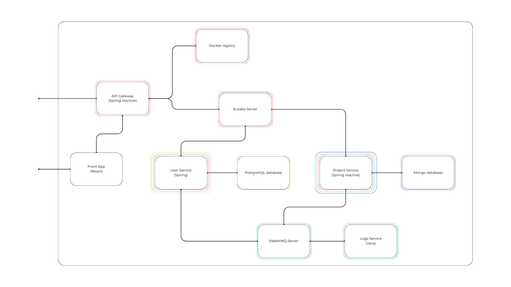

Le but du projet est de créer un service similaire aux azure container apps sur le cloud Azure.
Pour le moment j'ai surtout créé la plupart des services et fait une version automatisée avec docker compose, je vais bientot faire une version avec kubernetes et ensuite je vais implémenter les services entièrement.
J'ai donc fait une pipeline qui permet de déployer directement dans ma registry privée sur docker hub pour pouvoir après utiliser ses images avec kubernetes. (je vais surement remplacer par une registry privée en local).

Ensuite, il me reste à déterminer si je fait vraiment comme les Azure Container Apps et en gros avoir un Container Environment qui serait un cluster kubernetes, je ne pense pas faire comme ça car cela complexifierait énormément la chose, ce qui n'est pas le but ici. Je veux juste avoir une registry privée pour chaque organisation et qu'ensuite les services se créent automatiquement et bloquer l'accès si une personne ne fait pas partie d'une organisation. 
